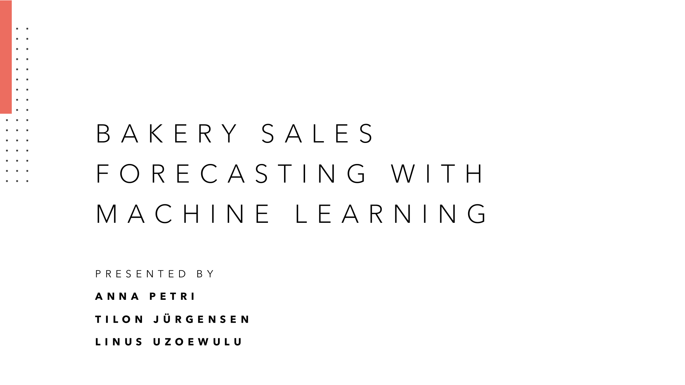

# Sales Forecasting for a Bakery Branch

## Repository Link

https://github.com/your_username/your_project_name

## 📊 Team 4 – Introduction to Data Science and Machine Learning (SS25)

Welcome! This repository contains all code, data, and documentation for the bakery sales forecasting project.

## Description

This project focuses on sales forecasting for a bakery branch, utilizing historical sales data spanning from July 1, 2013, to July 30, 2018, to inform inventory and staffing decisions. We aim to predict future sales for six specific product categories: Bread, Rolls, Croissants, Confectionery, Cakes, and Seasonal Bread. Our methodology integrates statistical and machine learning techniques, beginning with a baseline linear regression model to identify fundamental trends, and progressing to a sophisticated neural network designed to discern more nuanced patterns and enhance forecast precision. The initiative encompasses data preparation, crafting bar charts with confidence intervals for visualization, and fine-tuning models to assess their performance on test data from August 1, 2018, to July 30, 2019, using the Mean Absolute Percentage Error (MAPE) metric for each product category.

## Task Type

Regression

## 📂 Directory Overview

Each main directory contains a README with more details:

- [0_DataPreparation/](0_DataPreparation/README.md): All Jupyter notebooks and scripts for data preparation, analysis, modeling, and presentation.
- [1_DatasetCharacteristics/](1_DatasetCharacteristics/README.md): Notebooks for missing value analysis and dataset statistics.
- [2_BaselineModel/](2_BaselineModel/README.md): Baseline model notebooks and scripts.
- [3_Model/](3_Model/README.md): Model training, tuning, and evaluation scripts, models, and Keras Tuner results.
- [4_Presentation/](4_Presentation/README.md): Presentation materials and plots.
- [data/](data/README.md): All raw, intermediate, and processed data files.
- [docs/](docs/README.md): Documentation and visualizations.
- [example_notebooks/](0_DataPreparation/example_notebooks/README.md): Example notebooks for neural network data preparation and estimation.
- [weekly_tasks/](0_DataPreparation/weekly_tasks/README.md): Weekly assignments, experiments, and related data.

See each directory's README for a detailed description of its contents and purpose.

---

## 👥 Teammitglieder

- **Frieda**
- **Anna**
- **Tilon**
- **Linus**

Unser Gruppenchat für Kommunikation und Koordination:
🔗 [https://chat.opencampus.sh/opencampus/channels/ss25_ml_team_4](https://chat.opencampus.sh/opencampus/channels/ss25_ml_team_4)

---

## 📁 Inhalt dieses Repositories

Hier dokumentieren wir unsere gemeinsamen Arbeitsergebnisse und Wochenaufgaben im Rahmen des Kurses.
Dazu gehören unter anderem:

- Datenanalysen mit Pandas und Matplotlib / Seaborn
- Visualisierungen zu Umsatz-, Wetter- und Eventdaten
- Umgang mit Git, Codespaces und kollaborativer Entwicklung
- Exploration von Regular Expressions und DataFrame-Joins

---

## 🛠️ Technische Hinweise

- Alle Notebooks sind mit Python 3 und Pandas/Seaborn erstellt
- Die Daten stammen aus dem offiziellen Kurs-Repository:
  [https://github.com/opencampus-sh/einfuehrung-in-data-science-und-ml](https://github.com/opencampus-sh/einfuehrung-in-data-science-und-ml)
- Die Arbeit erfolgt innerhalb von GitHub Codespaces

---
## Results Summary

-   **Best Model:** Random Forest Model
-   **Evaluation Metric:** MAPE: 16.84 %
-   **Result by Category** (Identifier):
    -   **Bread** (1): [18.07]%
    -   **Rolls** (2): [11.04]%
    -   **Croissant** (3): [17.31]%
    -   **Confectionery** (4): [18.95]%
    -   **Cake** (5): [13.32]%
    -   **Seasonal Bread** (6): [49.88]%

## Cover Image

## 📌 Hinweis

Dieses Repository dient ausschließlich Bildungszwecken im Rahmen des Seminars im Sommersemester 2025.
Alle Teammitglieder sind zur Mitarbeit eingeladen und können gerne Pull Requests stellen oder eigene Branches nutzen.
